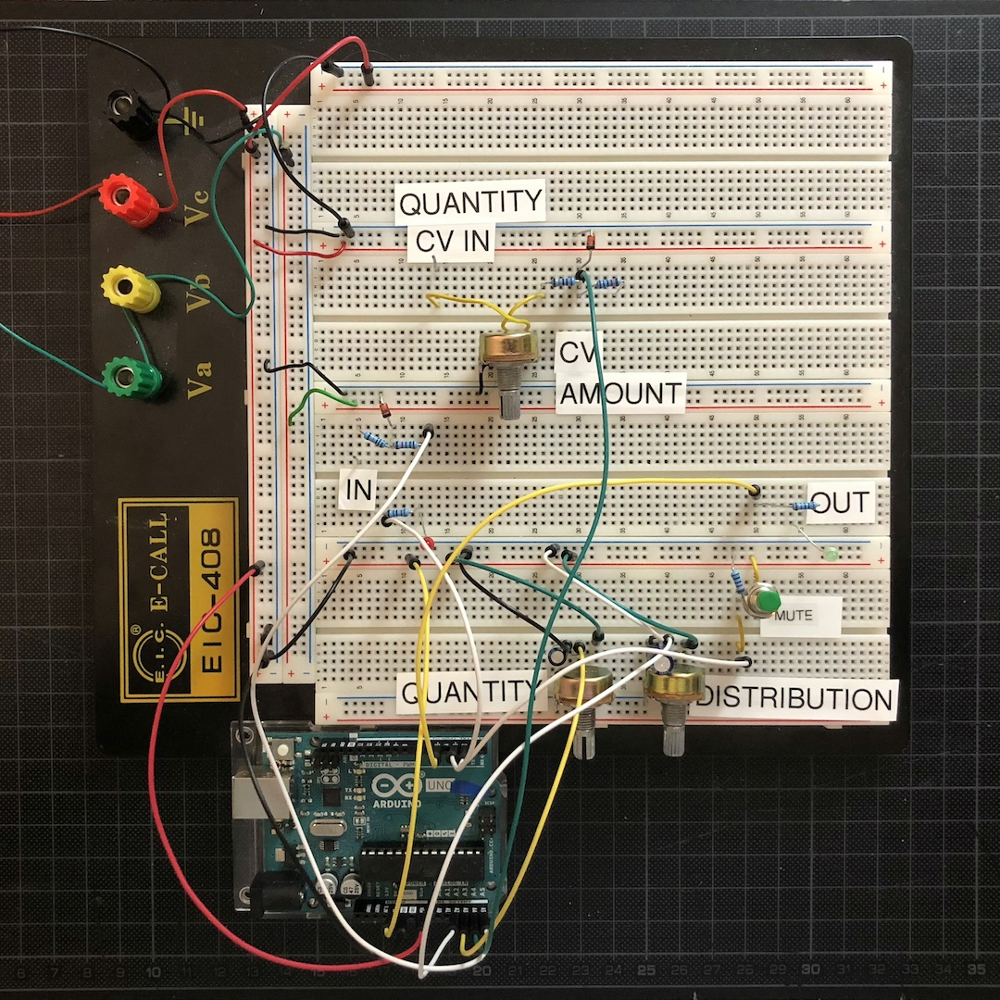

# Clock Multiplier

I've heard, especially with Lady Starlight, that techno tracks get more interesting when the bassline hits in triplets (3 hits), quintuplets (5 hits) or septuplets (7 hits). In contrast, the songs from my techno rack have always been relatively linear in this respect. That's why I build this Clock Multiplier. The main inspiration is Befaco's Burst, from which I took the terminology for quantity and distribution.

In the first step I implement the idea with an Arduino as a prototype, so I can quickly test the handling and features on the rack.

As a follow-on version, I'm building it around an ATMega, i.e. without a pre-built Arduino, making it much cheaper and space-saving.

## Ressources

**Revision 1 (Arduino on breadboard)**

* [Schematics (PDF)](Rev1/Bumm-Bumm-Garage-Clock-Multiplier-Rev1-Schematic.pdf)

<!--

## TODOs

* Output Opamp einbauen
* Use Cases finden
  * Fünftel Bass line über einen Takt
* (Startup Sequence einbauen)
* (Tap Clock einbauen)

### Features:

* Offene Schnittstelle am Modul, wenn man es hacken möchte für eigene Programme.
* Mute

### ATMega Standalone

* Build an Arduino:
  * https://www.instructables.com/Build-an-Arduino/
  * https://www.instructables.com/Build-Your-Own-Arduino/
  * https://duckduckgo.com/?q=build+an+arduino&ia=web
* Arduino Uno to ATmega328 - Shrinking your Arduino Projects: https://www.youtube.com/watch?v=Sww1mek5rHU

## Resources

* **Wolles How-To**  (https://wolles-elektronikkiste.de/atmega328p-standalone-betreiben#Anker3, shorted, and done with AVR Pocket Programmer and an ATMega328P-PU):
  * Choose "Tools > Board > Arduino Uno"
  * Choose "Tools > Programmer > USBtinyISP"
  * Click "Tools > Programmer > Burn Bootloader"
  * Upload sketch via "Sketch > Upload Using Programmer"
* **ATMega Digital and Analog Pins**: https://www.componentsinfo.com/atmega328p-pinout-configuration-datasheet/
* **Overvoltage Protection:**
  * https://forum.arduino.cc/t/12v-to-arduino-pin-zener-diode/529876/2#msg3759664

## Fragen

* Wie bekomme ich den ISP Programmer drauf (dann mit Strom oder ohne)?
  * ISP and power supply
* Welche Decoupling Caps für den ATMega mit dem uA7805?

-->
