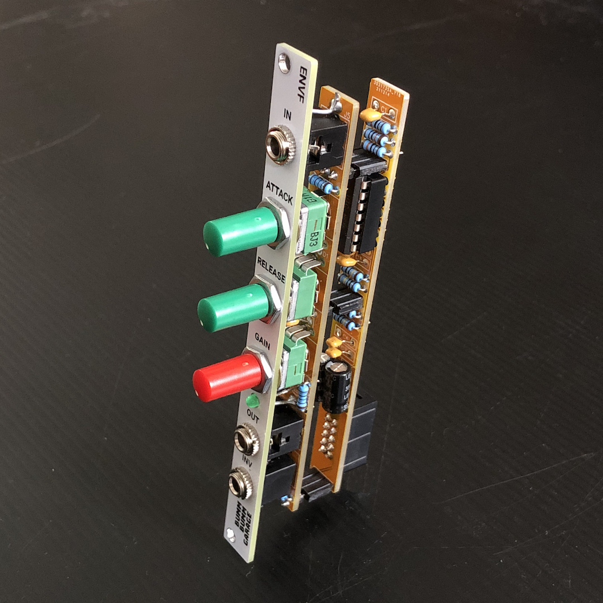
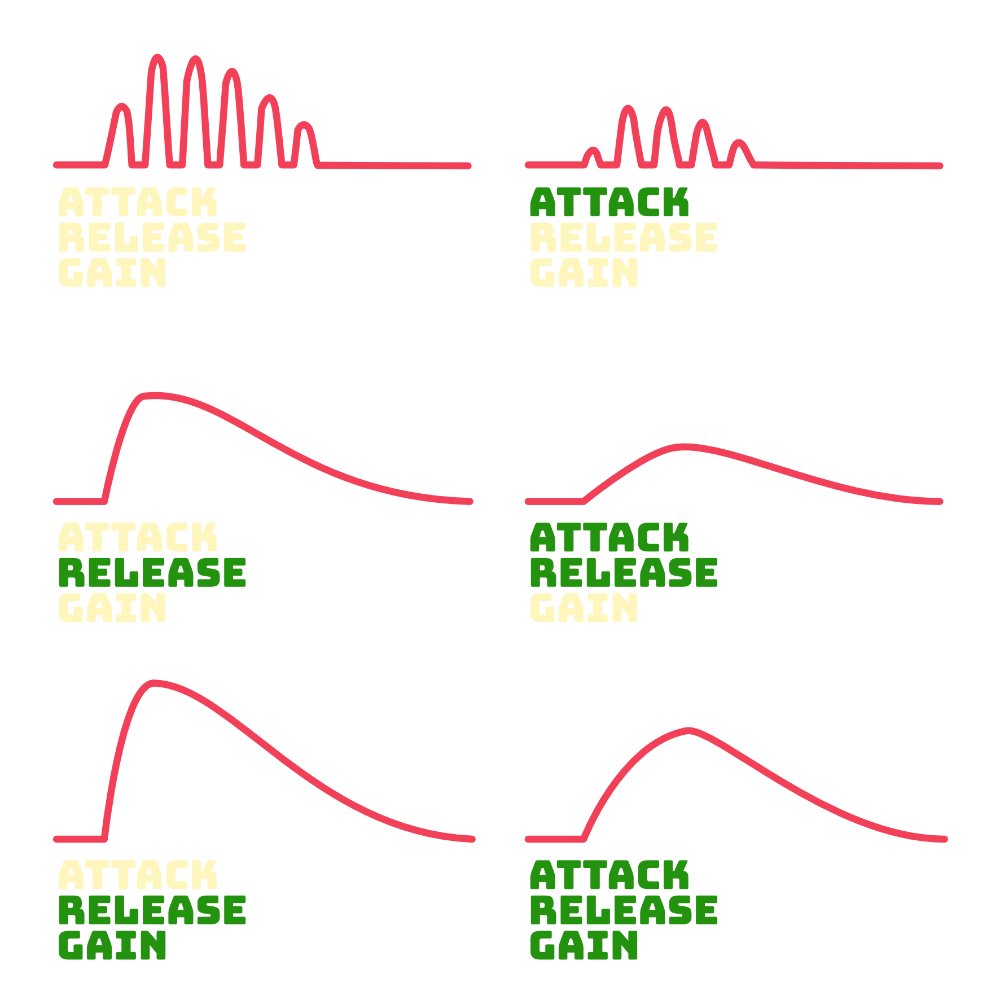
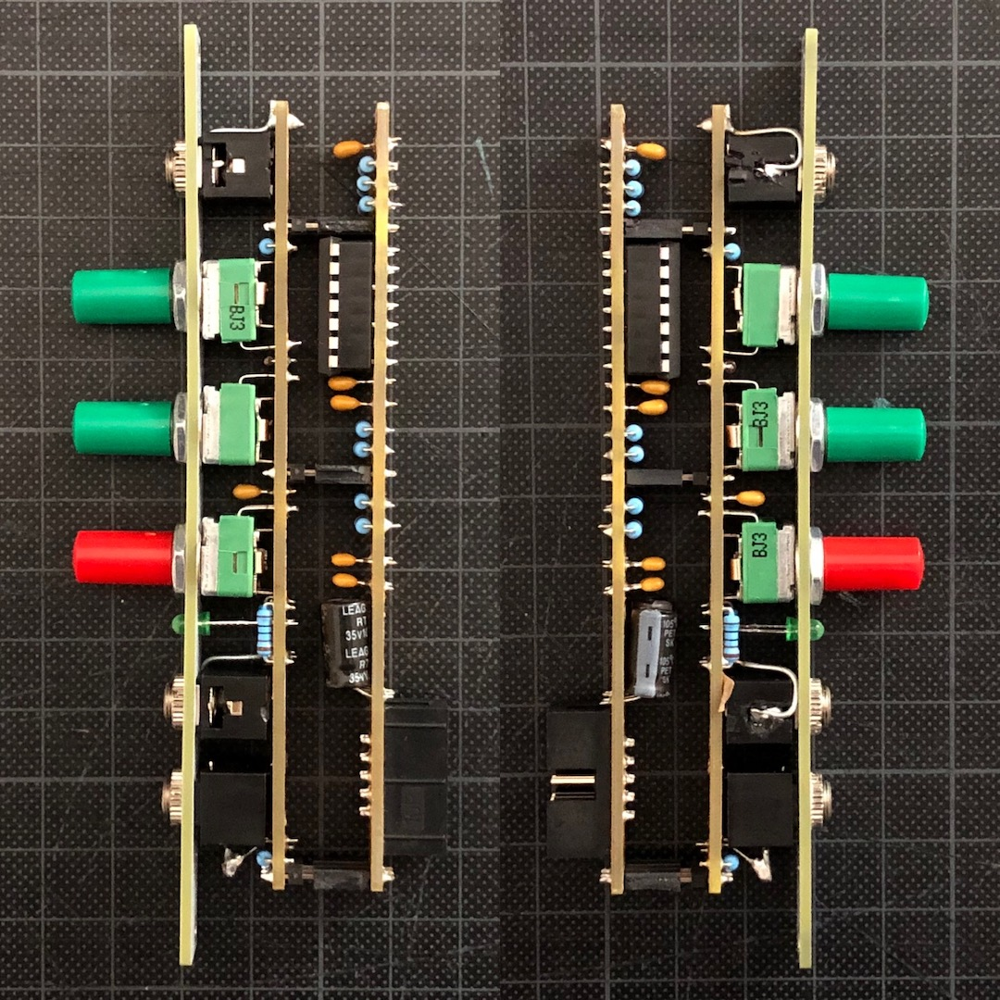
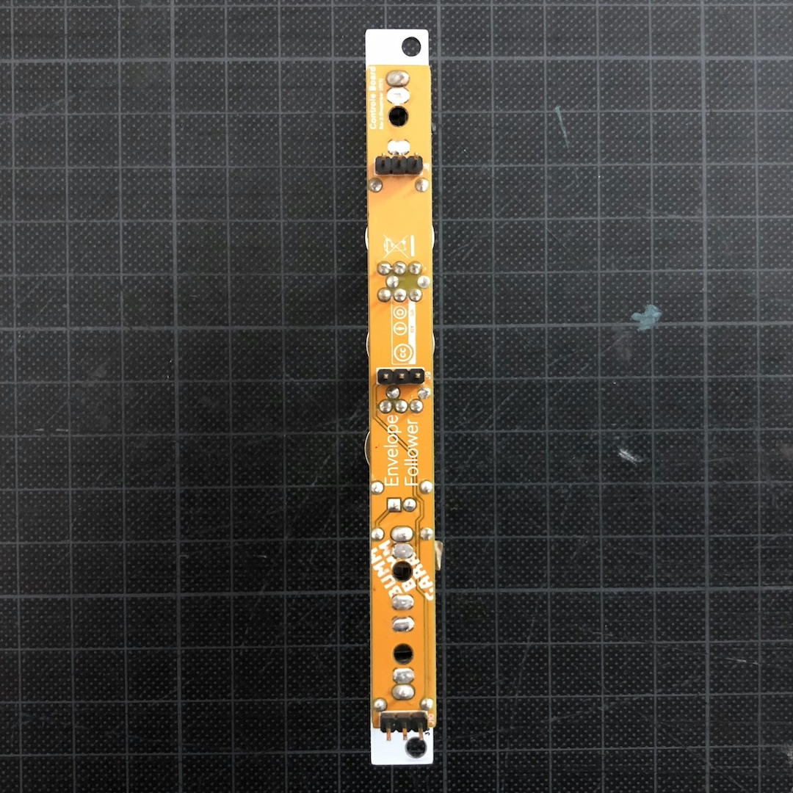

# Envelope Follower (ENVF)

Envelope follower that I built for my DIY modular synth techno rack. My main stakes in this module are being able to side chain and create duckings on voices when the kick hits. Someone in a techno production subreddit recommended me this after hearing some audio from my synth 👍🏻

## Features

* ✅ Attack, realease and gain controls
* ✅ Non-inverted and inverted out
* ✅ Only 2hp wide

## Specifications

**Controls:**

**Left and right view on the module:**

**Control board (bottom):**

**Main board (top and bottom):**

**Implementation:**

* The smoothing to create the envelope is based on peak detection, see [https://www.youtube.com/watch?v=jllsqRWhjGM](https://www.youtube.com/watch?v=jllsqRWhjGM) for instance.
* The attack isn't a real attack from my perspective. Meaning it does not delay the time when the signal peak is reached. It rather smooths the entire signal like an attenuator. I decided to call it "Attack" anyways since I'll use it mainly to reduce natural pops at the beginning of an envelope. Any loss in amplitude coming from this can be compensated with the gain 😊

<!--

## Use Cases And Tests

* 👍🏻✅ **Sidechain compressor mit Kick und Chords** – https://www.youtube.com/watch?v=lGtKlH0UeuA : um den Drop richtig wirken zu lassen. Volume und Filter Side Chain.
* 👍🏻✅ **Sidechain from Kick on Clapping Noise (Hihats) controlling volume** – https://youtu.be/ld04GHoWDUk?t=74
* 👍🏻 🟧Mit einem **Envelope über einem Bass** mischen, der über die Kick geht. Den dann in den VCA packen : Kann es leider noch nicht zusammenmischen. Brauch den neuen Mixer :)
* 👍🏻✅ **Bass Riff from Drum Envelope** – https://www.youtube.com/watch?v=aByLEB_AZaE (Hälfte) mit Hihats bestimmt witzig.
* 👍🏻 **Envelope from Drum Loop Modulating Pitch** – https://www.youtube.com/watch?v=XZxf5caWySw – Interessant, um die Response zu testen (Auflösung).
* 👍🏻 Envelope **Modulating Filter on Drum Loop**: https://www.youtube.com/watch?v=ld04GHoWDUk
* 👍🏻 **Guitar in controlling VCA with sequenced melody**: https://youtu.be/ld04GHoWDUk?t=150

## Post Text Rev2

Prototype of an envelope follower that I built for my DIY modular synth techno rack. My main stakes in this module are being able to side chain and create duckings on voices when the kick hits #technotechno

Swipe to see some video demos, the schematic and the panel design that I have in mind. 

What I did in the videos:

1. Muting noisy claps when the kick hits (kick's envelope on VCF).
2. Muting chords when the kick hits (kick's envelope on VCF).
3. Muting hihats when the kick hits (kick's envelope in VCA).
4. Creating bass line from drum pattern (mixed drums' envelope in VCA).

Disclaimer: The attack isn't a real attack from my perspective. Meaning it does not delay the time when the signal peak is reached. It rather smooths the entire signal like an attenuator. I decided to call it "Attack" anyways since I'll use it mainly to reduce natural pops at the beginning of an envelope. Any loss in amplitude coming from this can be compensated with the gain :)

Next steps will be designing the PCBs and the final panel design.

[#synthdiy](https://www.instagram.com/explore/tags/synthdiy/) [#diysynth](https://www.instagram.com/explore/tags/diysynth/) [#sdiy](https://www.instagram.com/explore/tags/sdiy/) [#diymodularsynth](https://www.instagram.com/explore/tags/diymodularsynth/) [#diysynthesizer](https://www.instagram.com/explore/tags/diysynthesizer/) [#diyelectronics](https://www.instagram.com/explore/tags/diyelectronics/)

-->

## Resources

**Revision 1**

* [Schematics (PDF)](Rev1/Bumm-Bumm-Garage-Envelope-Follower-Rev1-Schematic.pdf)
* Feedback on [Reddit](https://www.reddit.com/r/synthdiy/comments/rbitj4/simple_envelope_follower_circuit/) and [Modwiggler](https://www.modwiggler.com/forum/viewtopic.php?p=3657388#p3657388)

**Revision 2 (breadboard prototype)**

What's new? I added variable release (poti).

* [Schematics (PDF)](Rev2/Bumm-Bumm-Garage-Envelope-Follower-Rev2-Schematic.pdf)
* Showcase and feedback on [Reddit](https://www.reddit.com/r/synthdiy/comments/rd2off/simple_envelope_follower_circuit_rev_2/) and [Instagram](https://www.instagram.com/p/CXRuK9rNRQo/)

**Revision 3 (PCB prototype)**

What's new? I brought it on PCB level.

* [Video Demo: Sidechaining On Bass Line](https://youtu.be/aDxRjQ9Nlts) 
* [Video Demo: Bass Line From Hihat Beat](https://www.youtube.com/watch?v=DFfUIPmgM-s)
* [Schematics (PDF)](Rev3/Bumm-Bumm-Garage-Envelope-Follower-Rev3-Schematic.pdf)
* [BOM (XLS)](Rev3/Bumm-Bumm-Garage-Envelope-Follower-Rev3-BOM.xls)
* Showcase and feedback on [Reddit](https://www.reddit.com/r/synthdiy/comments/sg73az/envelope_follower_pcb_prototype_eurorack/) and [Instagram](https://www.instagram.com/p/CZWg2FJMRuM/)
* Improvement potential on [GitHub (issues)](https://github.com/bummbummgarage/bummbummgarage.github.io/issues?q=is%3Aissue+is%3Aopen+%5BENVF+Rev3%5D) – The main thing here is that I that I set the pins of the thonkiconns wrong way around on the PCB 🤦 With some tweaking and bending I could fix that, but will not publish the spoilt Gerber files of this revision here.
