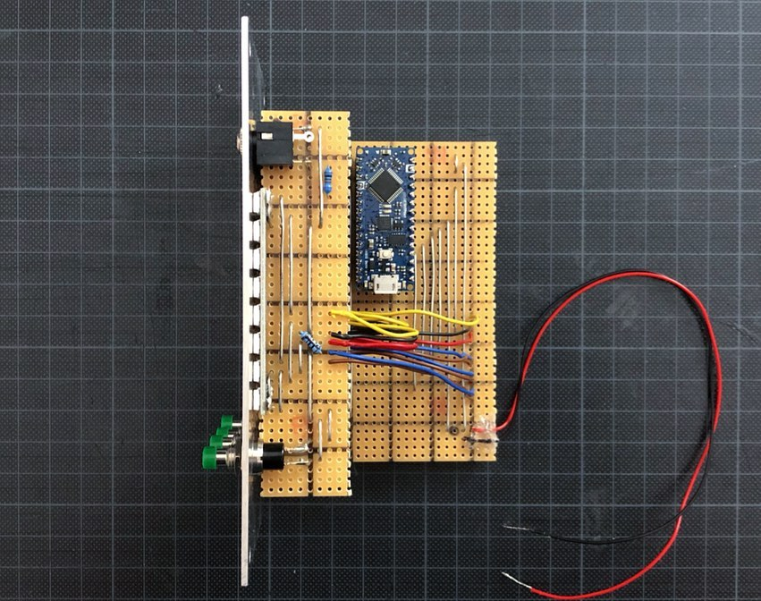
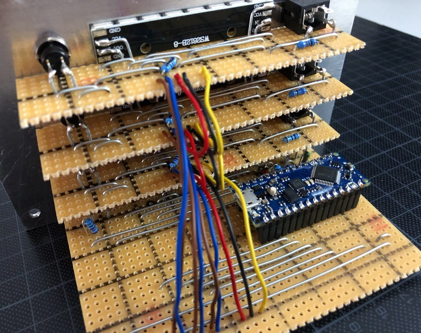

# Sequencer

*Version 0.1 from October 2020*

Step sequencer with gates and triggers that I built for my drum machine project. It's based on an Arduino Nano Every.

## Features

* ✅ 8 steps
* ✅ 3 tracks
* ✅ Speed control by external CV (triggers/gates forwarded with 5V)
* ✅ Speed control by internal clock (speed set by tapping, sending 5V triggers)
* ✅ Set and unset track hits on the run
* ✅ Predefined track patterns

## Details

## Links

* [Video Demo](Bumm Bumm Garage Sequencer 0.1 Video Demo 720p.mp4)
* [Schematic (PDF)](Bumm Bumm Garage Sequencer 0.1 Schematic.pdf)
* [Stripboard Layout (PDF)](Bumm Bumm Garage Sequencer 0.1 Stripboard Layout.pdf)
* [Arduino Sketch (Code)](https://github.com/bummbummgarage/bummbummgarage.github.io/blob/main/modules/sequencer-0.1/Bumm%20Bumm%20Garage%20Sequencer%200.1.ino)
* [Front Panel (PDF)](Bumm Bumm Garage Sequencer 0.1 Panel.pdf)

## User Manual

1. Set the internal clock speed (step display lights are blinking): Tap the steps button four times.
2. Unset the internal clock (step display is running): Hold the steps button for two seconds.
3. Set and unset track hits (step display is running): Push the according track button once.
4. Use an external CV: Plug it in the track jack.
5. Start steps at position 1 (step display is running): Push the steps button once.
6. Choose a predefined track pattern: Hold the according track button for two seconds to enter the mode, push it once to skip through the patterns, leave it for two seconds to activate the current pattern.

## Improvement Potential

See the comments on [Instagram](https://www.instagram.com/p/CGXFEG8herM/) and [Reddit](https://www.reddit.com/r/synthdiy/comments/jbl6rk/8_steps_3_tracks_sequencer_based_on_arduino/).